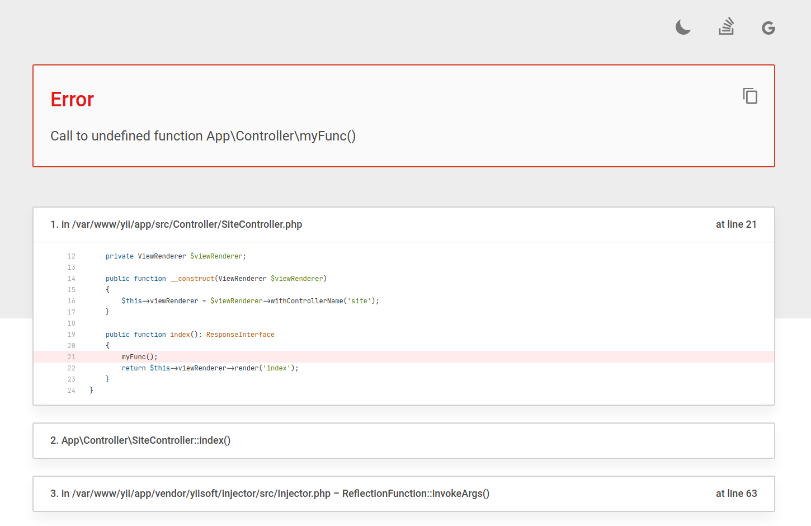

<p align="center">
    <a href="https://github.com/yiisoft" target="_blank">
        
    </a>
    <h1 align="center">Yii Error Handler</h1>
    <br>
</p>

[](https://packagist.org/packages/yiisoft/error-handler)
[](https://packagist.org/packages/yiisoft/error-handler)
[](https://github.com/yiisoft/error-handler/actions/workflows/build.yml)
[](https://codecov.io/gh/yiisoft/error-handler)
[](https://dashboard.stryker-mutator.io/reports/github.com/yiisoft/error-handler/master)
[](https://github.com/yiisoft/error-handler/actions?query=workflow%3A%22static+analysis%22)

The package provides advanced error handling. The features are:

- PSR-15 middleware for catching unhandled errors.
- PSR-15 middleware for mapping certain exceptions to custom responses.
- Production and debug modes.
- Debug mode displays details, stacktrace, has dark and light themes and handy buttons to search for error without typing.  
- Takes PHP settings into account.
- Handles out of memory errors, fatals, warnings, notices and exceptions.
- Can use any PSR-3 compatible logger for error logging.
- Detects response format based on mime type of the request.
- Supports responding with HTML, plain text, JSON, XML and headers out of the box.
- Has ability to implement your own error rendering for additional types.
- [Friendly exceptions](https://github.com/yiisoft/friendly-exception/) support.

<picture>
 <source media="(prefers-color-scheme: dark)" srcset="docs/images/view-development-dark.png">
 <source media="(prefers-color-scheme: light)" srcset="docs/images/view-development-light.png">
 
</picture>

## Requirements

- PHP 8.1 - 8.5.
- `DOM` PHP extension.
- `mbstring` PHP extension.

## Installation

The package could be installed with [Composer](https://getcomposer.org):

```shell
composer require yiisoft/error-handler
```

## General usage

Creating an error handler:

```php
use Yiisoft\ErrorHandler\ErrorHandler;
use Yiisoft\ErrorHandler\Renderer\HtmlRenderer;

/**
 * @var \Psr\Log\LoggerInterface $logger
 */

$errorHandler = new ErrorHandler($logger, new HtmlRenderer());
```

The error handler logs information about the error using any [PSR-3](https://www.php-fig.org/psr/psr-3/)
compatible logger. If for some reason you do not want to log error information,
specify an instance of the `\Psr\Log\NullLogger`.

By default, the error handler is set to production mode and displays no detailed information.
You can enable and disable debug mode as follows:

```php
// Enable debug mode:
$errorHandler->debug();

// Disable debug mode:
$errorHandler->debug(false);

// Or define the environment dynamically:
$errorHandler->debug($_ENV['debug'] ?? false);
```

The error handler handles out-of-memory errors. To achieve it, memory is pre-allocated so that if a problem occurs with
a lack of memory, the error handler can handle the error using this reserved memory. You can specify your own reserve
size using the `memoryReserveSize()` method. If you set this value to 0, no memory will be reserved.

```php
// Allocate 512KB. Defaults to 256KB.
$errorHandler->memoryReserveSize(524_288);
```

The `register()` method registers the PHP error and exception handlers.
To unregister these and restore the PHP error and exception handlers, use the `unregister()` method.

```php
$errorHandler->register();
// Errors are being handled.
$errorHandler->unregister();
// Errors are not handled.
```

### Rendering error data

The following renderers are available out of the box:

- `Yiisoft\ErrorHandler\Renderer\HeaderRenderer` - Renders error into HTTP headers. It is used for HEAD requests.
- `Yiisoft\ErrorHandler\Renderer\HtmlRenderer` - Renders error into HTML.
- `Yiisoft\ErrorHandler\Renderer\JsonRenderer` - Renders error into JSON.
- `Yiisoft\ErrorHandler\Renderer\PlainTextRenderer` - Renders error into plain text.
- `Yiisoft\ErrorHandler\Renderer\XmlRenderer` - Renders error into XML.

If the existing renderers are not enough, you can create your own. To do this, you must implement the
`Yiisoft\ErrorHandler\ThrowableRendererInterface` and specify it when creating an instance of the error handler.

```php
use Yiisoft\ErrorHandler\ErrorHandler;

/**
 * @var \Psr\Log\LoggerInterface $logger
 * @var \Yiisoft\ErrorHandler\ThrowableRendererInterface $renderer
 */

$errorHandler = new ErrorHandler($logger, $renderer);
```

For more information about creating your own renders and examples of rendering error data,
[see here](https://github.com/yiisoft/docs/blob/master/guide/en/runtime/handling-errors.md#rendering-error-data).

### Using a factory to create a response

`Yiisoft\ErrorHandler\ThrowableResponseFactory` renders `Throwable` object and produces a response according to the content type provided by the client.

```php
use Yiisoft\ErrorHandler\RendererProvider;
use Yiisoft\ErrorHandler\ThrowableResponseFactory;

/**
 * @var \Throwable $throwable
 * @var \Psr\Container\ContainerInterface $container
 * @var \Psr\Http\Message\ResponseFactoryInterface $responseFactory
 * @var \Psr\Http\Message\ServerRequestInterface $request
 * @var \Yiisoft\ErrorHandler\ErrorHandler $errorHandler
 */

$throwableResponseFactory = new ThrowableResponseFactory(
    $responseFactory,
    $errorHandler,
    new RendererProvider\CompositeRendererProvider(
        new RendererProvider\HeadRendererProvider(),
        new RendererProvider\ContentTypeRendererProvider($container),
    ),
);

// Creating an instance of the `Psr\Http\Message\ResponseInterface` with error information.
$response = $throwableResponseFactory->create($throwable, $request);
```

`Yiisoft\ErrorHandler\ThrowableResponseFactory` chooses how to render an exception by renderer provider. Providers
available out of the box:

- `HeadRendererProvider` - renders error into HTTP headers. It is used for HEAD requests.
- `ContentTypeRendererProvider` - renders error based on accept HTTP header. By default, JSON, XML and plain text are 
  supported.
- `ClosureRendererProvider` - allows you to create your own renderer provider using closures.
- `CompositeRendererProvider` - allows you to combine several renderer providers.

### Using a middleware for catching unhandled errors

`Yiisoft\ErrorHandler\Middleware\ErrorCatcher` is a [PSR-15](https://www.php-fig.org/psr/psr-15/) middleware that
catches exceptions raised during middleware stack execution and passes them to the instance of `Yiisoft\ErrorHandler\ThrowableResponseFactoryInterface` to create a response.

```php
use Yiisoft\ErrorHandler\Middleware\ErrorCatcher;

/**
 * @var \Psr\EventDispatcher\EventDispatcherInterface $eventDispatcher
 * @var \Psr\Http\Message\ServerRequestInterface $request
 * @var \Psr\Http\Server\RequestHandlerInterface $handler
 * @var \Yiisoft\ErrorHandler\ThrowableResponseFactoryInterface $throwableResponseFactory
 */

$errorCatcher = new ErrorCatcher($throwableResponseFactory);

// In any case, it will return an instance of the `Psr\Http\Message\ResponseInterface`.
// Either the expected response, or a response with error information.
$response = $errorCatcher->process($request, $handler);
```

`Yiisoft\ErrorHandler\Middleware\ErrorCatcher` can be instantiated with [PSR-14](https://www.php-fig.org/psr/psr-14/) event dispatcher as an optional dependency.
In this case `\Yiisoft\ErrorHandler\Event\ApplicationError` will be dispatched when `ErrorCatcher` catches an error.

```php
$errorCatcher = new ErrorCatcher($throwableResponseFactory, $eventDispatcher);
```

### Using a middleware for mapping certain exceptions to custom responses

`Yiisoft\ErrorHandler\Middleware\ExceptionResponder` is a [PSR-15](https://www.php-fig.org/psr/psr-15/)
middleware that maps certain exceptions to custom responses.

```php
use Yiisoft\ErrorHandler\Middleware\ExceptionResponder;

/**
 * @var \Psr\Http\Message\ResponseFactoryInterface $responseFactory
 * @var \Psr\Http\Message\ServerRequestInterface $request
 * @var \Psr\Http\Server\RequestHandlerInterface $handler
 * @var \Yiisoft\Injector\Injector $injector
 */
 
$exceptionMap = [
    // Status code with which the response will be created by the factory.
    MyNotFoundException::class => 404,
    // PHP callable that must return a `Psr\Http\Message\ResponseInterface`.
    MyHttpException::class => static fn (MyHttpException $exception) => new MyResponse($exception),
    // ...
];

$exceptionResponder = new ExceptionResponder($exceptionMap, $responseFactory, $injector);

// Returns the expected response, or the response associated with the thrown exception,
// or throws an exception if it does not present in the exception map.
$response = $exceptionResponder->process($request, $handler);
```

In the application middleware stack `Yiisoft\ErrorHandler\Middleware\ExceptionResponder` must be placed before
`Yiisoft\ErrorHandler\Middleware\ErrorCatcher`.

## Events

- When `ErrorCatcher` catches an error it optionally dispatches `\Yiisoft\ErrorHandler\Event\ApplicationError` event. Instance of `Psr\EventDispatcher\EventDispatcherInterface` must be provided to the `ErrorCatcher`.

## Friendly Exceptions

`HtmlRenderer` supports [friendly exceptions](https://github.com/yiisoft/friendly-exception/).

Code blocks in solution markdown support language syntax highlight:

| Language   | Aliases                                                |
|------------|--------------------------------------------------------|
| Bash       | bash, sh, zsh                                          |
| CSS        | css                                                    |
| HTML, XML  | xml, html, xhtml, rss, atom, xjb, xsd, xsl, plist, svg |
| JavaScript | javascript, js, jsx                                    |
| JSON       | json                                                   |
| PHP        | php                                                    |
| Plaintext  | plaintext, txt, text                                   |
| SQL        | sql                                                    |

For example:

```html
<html>
<body>
    <p>This text is normal.</p>
    <p><b>This text is bold.</b></p>
</body>
</html>
```

## Documentation

- [Yii guide to handling errors](https://github.com/yiisoft/docs/blob/master/guide/en/runtime/handling-errors.md)
- [Internals](docs/internals.md)

If you need help or have a question, the [Yii Forum](https://forum.yiiframework.com/c/yii-3-0/63) is a good place for that.
You may also check out other [Yii Community Resources](https://www.yiiframework.com/community).

## License

The Yii Error Handler is free software. It is released under the terms of the BSD License.
Please see [`LICENSE`](./LICENSE.md) for more information.

Maintained by [Yii Software](https://www.yiiframework.com/).

## Credits

The Yii Error Handler use code of [Highlight.js](https://highlightjs.org/) by Ivan Sagalaev and other contributors.

## Support the project

[](https://opencollective.com/yiisoft)

## Follow updates

[](https://www.yiiframework.com/)
[](https://twitter.com/yiiframework)
[](https://t.me/yii3en)
[](https://www.facebook.com/groups/yiitalk)
[](https://yiiframework.com/go/slack)
